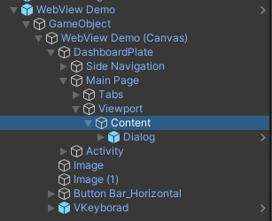
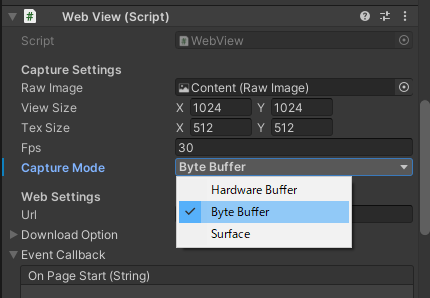

# TLabWebViewMRTK3
Sample project for using [```TLabWebView```](https://github.com/TLabAltoh/TLabWebView) (3D web browser / 3D WebView plugin) with [```MRTK3```](https://learn.microsoft.com/en-us/windows/mixed-reality/mrtk-unity/mrtk3-overview/)

[Document is here](https://tlabgames.gitbook.io/tlabwebview)  
[Snippets is here](https://gist.github.com/TLabAltoh/e0512b3367c25d3e1ec28ddbe95da497#file-tlabwebview-snippets-md)

> [!NOTE]
> This is a project created for Oculus Quest 2 using MRTK3, but it will not work with HoloLens. This is because the WebView used is an Oculus (or Android) dependent system.

> [!WARNING]
> This project uses `HardwareBuffer` as the default `CaptureMode` for WebView. This `HardwareBuffer` option is confirmed to work with Oculus Quest, but may not work with some other devices (e.g., the WebView screen may go blank). In that case, change the `CaptureMode` from `HardwareBuffer` to `ByteBuffer`.
>
> <details>
> </img><br>
> </img>
> </details>

## ScreenShot
</img>

## Operating Environment
- Oculus Quest 2
- Qualcomm Adreno650

## Requirements
- Unity 2021.3 LTS
- [MRTK3](https://learn.microsoft.com/ja-jp/windows/mixed-reality/mrtk-unity/mrtk3-overview/)
- [TLabVKeyborad](https://github.com/TLabAltoh/TLabVKeyborad.git)
- [TLabWebView](https://github.com/TLabAltoh/TLabWebView.git)

## Get Started

### Installing

Clone the repository with the following command

```
git clone https://github.com/TLabAltoh/TLabWebViewMRTK3.git

cd TLabWebViewMRTK3

git submodule update --init
```

### Set Up
Please see the setup section [here](https://github.com/TLabAltoh/TLabWebView?tab=readme-ov-file#set-up)

### Sample Scene
```
/Assets/Scenes/SampleScene.unity
```
